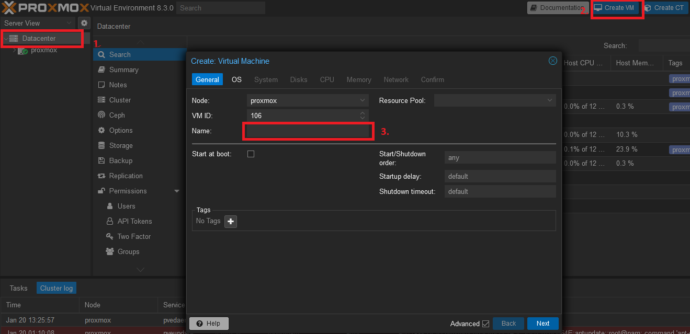
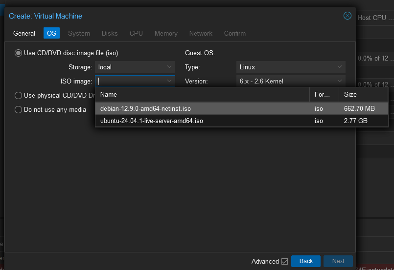
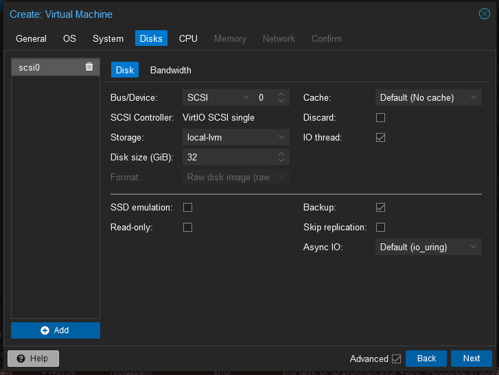
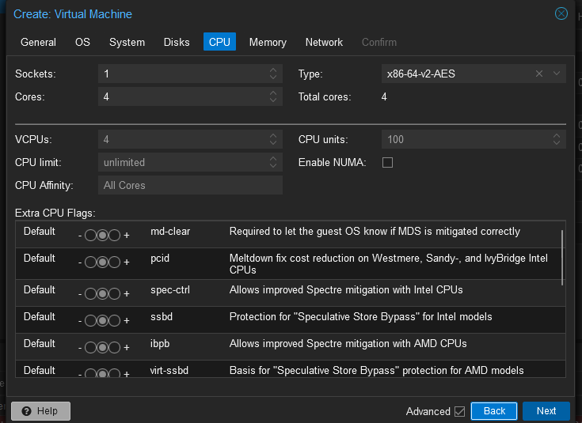
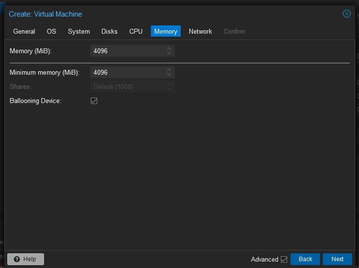
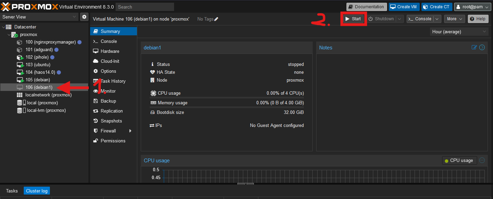
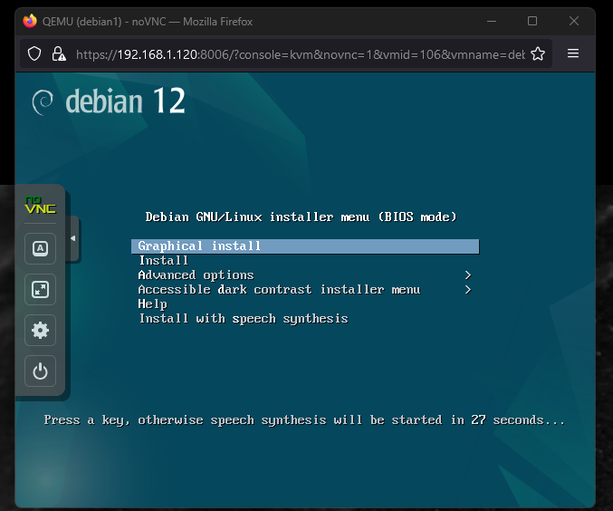
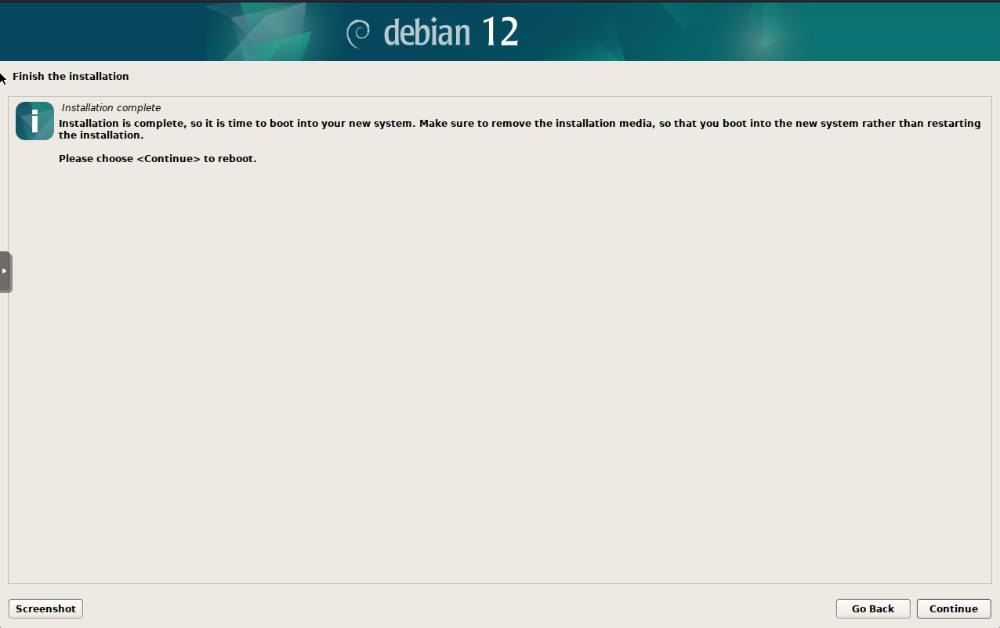
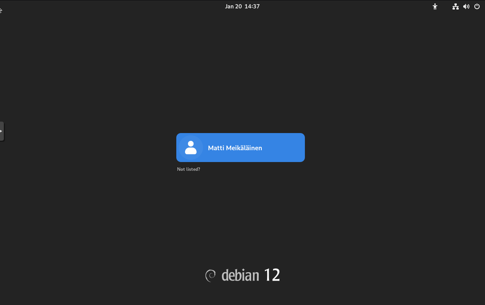
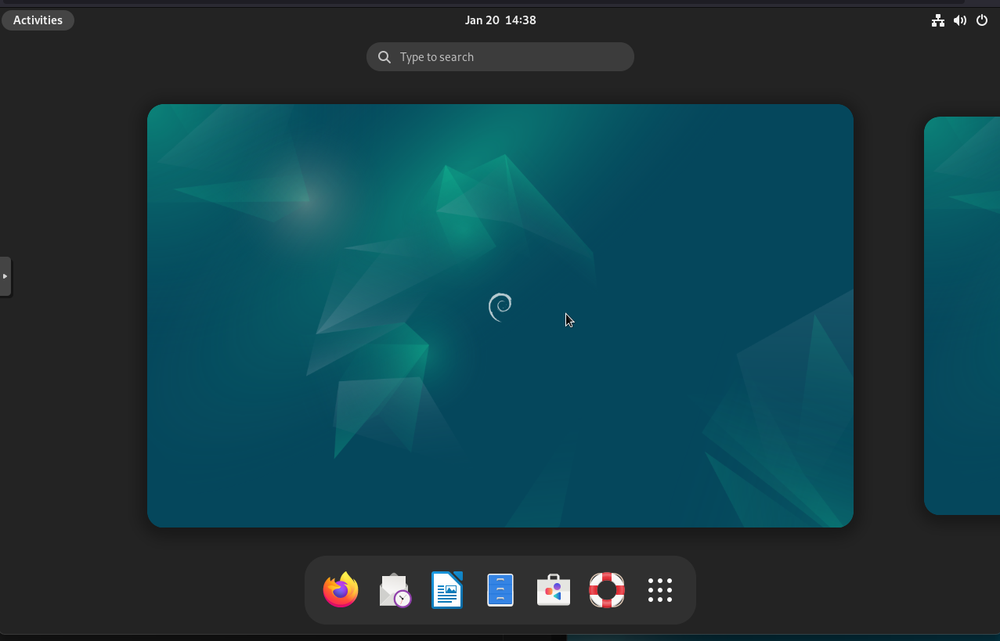

# h1 Oma Linux

**Raportin kirjoittaminen**

- raporttien täytyy olla toistettavissa, täsmällisiä ja helppolukuisia
- raportista pitää tulla aina sama tulos
- muista ilmoittaa käyttöympäristö
- dokumentoi tarkasti tehdyt toiminpiteet ja tulokset
- muista myös raportoida odottamattomat tulokset
- ilmoita lähde
- älä sepitä
- älä plagioi

**FSF Free Software Definition**

- Vapaus 0: Vapaus käyttää/ajaa ohjelmaa haluamallasi tavalla, mihin tahansa tarkoitukseen.
- Vapaus 1: Vapaus tutkia lähdekoodista kuinka ohjelma toimii, ja muokata sitä.
- Vapaus 2: Vapaus levittää ohjelmaa.
- Vapaus 3: Vapaus levittää omia muokattuja versioita.

  
## Linuxin asentaminen virtuaalikoneelle

Tässä ohjeessa käytän [Proxmox](https://www.proxmox.com/en/) virtualisointialustaa luodakseni Debian 12 virtuaalikoneen. Käytän Debian 12 [levykuvatiedostoa.](https://www.debian.org/download)

Mene Proxmoxiin ja valitse datacenter, sieltä create VM ja anna virtuaalikoneelle haluamasi nimi.

Jatka "OS" kohtaan ja "ISO- image"  ja valitse debian-12.9.0-amd64-netinst.iso tai muu lataamasi levykuvake ja paina next.

Jatka valitsemaan levytilan koko. Tässä esimerkissä valitsen 32gb.

Jatka kohtaan CPU ja valitse itsellesi sopiva konfiguraatio, kuten esimerkiksi 1 Socket ja 4 Corea.

Jatka kohtaan Memory ja valitse 4GB keskusmuistia.

Kun virtuaalikone on luotu, on aika käynnistää se. Mene "Datacenter" --> "proxmox", etsi sieltä luomasi virtuaalikone ja käynnistä se.

Kun virtuaalikone on käynnistynyt eteesi tulee debianin asennusvalikko. Valitse "Graphical install" ja mene asennus läpi. 

Asennuksen lopussa paina "continue" ja virtuaalikone boottaa juuri asentamaasi debian asennukseen. 

Kirjaudu sisään asennusvaiheessa tehdyllä käyttäjällä ja pääset työpöydälle. Debian on valmis käytettäväksi. 

