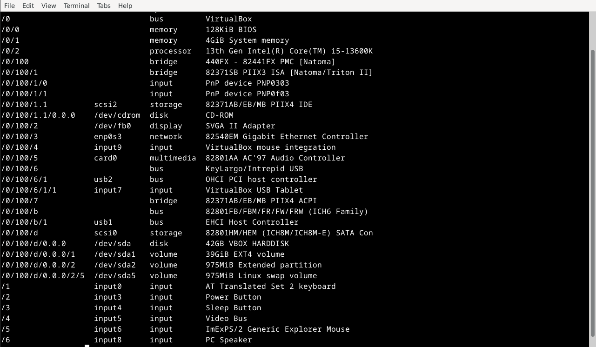

## Komentorivin käyttö

- pwd näyttää nykyisen hakemiston, ls listaa tiedostot hakemistossa ja cd vaihtaa hakemistoa

- mkdir:in avulla luodaan uusia kansioita ja mv komennolla voi siirtää ja rm poistaa

- ssh avaa etäyhteyden ja scp avulla voi kopioida tiedostoja

## a) micron asennus

Aloitin [micro-editorin](https://www.proxmox.com/en/) asentamisen avaamalla terminaalin ja kirjoittamalla siihen komento "sudo apt install micro". Asennuksen jälkeen editori on avattavissa laittamalla terminaaliin "micro". Kuvassa on esimerkkinäkymä microsta.

## b) Uusien komentoriviohjelmien asennus

Valitsin komentoriviohjelmiksi vim, emacs ja gedit. Kaikki kolme on helppo asentaa samaan aikaan kirjoittamalla terminaaliin komento "sudo apt update && sudo apt install -y vim emacs gedit". Komento päivittää package listin ja asentaa kaikki kolme komentoriviohjelmaa. laittamalla "-y"voi automaattisesti hyväksyä asennukset.

Asennuksen jälkeen käynnistän kaikki asentamani ohjelmaa kirjoittamalla esimerkiksi "vim" terminaaliin käynnistääkseni sen. Kuvassa esimerkkinä miltä eri ohjelmat näyttää. Vasen yläkulma on vim, oikea yläkulma on emacs ja alin on gedit.

## c) Filesystem Hierarchy Standard

 FHS. Esittele kansiot, jotka on listattu "Command Line Basics Revisited" kappaleessa "Important directories". Näytä kuvaava esimerkki kunkin tärkeän kansion sisältämästä tiedostosta tai kansiosta. Jos kyseessä on tiedosto, näytä siitä kuvaava esimerkkirivi. Työskentele komentokehotteessa ja näytä komennot, joilla etsit esimerkit.

 ### "/" eli root directory

 Tiedostojärjestelmän ylin taso on root. Pääsen selailemaan tasolla olevia tiedostoja ja kansioita kirjoittamalla terminaaliin "cd /" jolla vaihdan active directoryn ja pystyn komennolla "ls" listaamaan kaikki tiedostot ja kansiot.

 

 ### "/home/" eli kotihakemisto

 Kotihakemisto sisältää koneen kaikkien käyttäjien omat hakemistot. Voin tutkia kotihakemiston kansioita ja teidostoja kirjoittamalla terminaaliin "cd home" ja sen jälkeen "ls". Tällä koneella on vain yksi käyttäjä nimeltä testaaja ja käyttäjän kotihakemisto on näkyvissä. Voin navigoida tutkimaan käyttäjän tiedostoja olemalla home hakemistossa ja kirjoittamalla terminaaliin "cd testaaja" ja sen jälkeen "ls".

 

### "/etc/" hakemisto

Tämä hakemisto sisältää kaikki käyttöjärjestelmän asetukset tekstitiedostona. Tekstitiedostot voin avata vaikka asentamallani micro-editorilla komennolla "micro sysctl.conf" joka tässä tapauksessa avaa sysctl.conf tiedoston muokkausta varten.

### "/media/" hakemisto

Hakemisto sisältää liitetyt CD/DVD ja USB-levyt

### "/var/log/" hakemisto

Hakemisto sisältää järjestelmälokit joiden avulla voi diagnisoida ongelmia sekä seurata tapahtumia.

## grep-komento

grep-komennolla voi vaikka laskea kuinka useasti jokin tietty termi löytyy tekstitiedostosta. Otan esimerkkinä sysctl.conf tekstitiedoston ja haluan tietää kuinka usein sana "sys" löytyy tekstistä. Tämä onnistuu navigoimalla kansioon missä tekstitiedosto on (cd komento) ja kirjoittamalla terminaaliin "grep -c "sys" sysctl.conf". Esimerkissä saan takaisin numeron 7, tarkoittaen että tekstitiedostossa on seitsemän kertaa sana "sys". Voin myös etsiä sanaa esimerkiksi sanaa "conf" tekstistä komennolla  "grep -w "sys" systemctl.conf" ja komentoriviin ilmestyy kohdat jossa käytetään sanaa.

## putket eli pipes (|)

Pipes (putket) ovat työkaluja, joiden avulla voidaan yhdistää eri komentojen suorittamat tehtävät toisiinsa siten, että yhden komennon tuloste siirtyy suoraan toisen komennon syötteeksi. Tämä tapahtuu käyttämällä pystysuoraa viivaa (|) komentojen välillä. 

Esimerkkinä voin etsiä jonkin tietyn kansion suurimmat tiedostot. Käytän tähän komentoa "du -h | sort -h | tail -n 10". "du -h" näyttää tiedostojen ja kansioiden koot, "sort -h" järjestää teidostot koon mukaan ja "tail -n 10" näyttää suurimmat 10 tiedostoa. Kaikkia komentoja voi myös käyttää erikseen, mutta putkien suuri etu on juuri komentojen yhdistäminen toisiinsa asioiden nopeuttamiseksi.

## Rauta

Ottaakseni selvää mitä rautaa koneessani on jouduin ensin asentamaan "lshw" ohjelman komentorivin kautta käyttäen komentoa "sudo apt install lshw" ja asennuksen jälkeen käynnistän sen laittamalla "lshw" terminaaliin ja minulle aukeaa tämä näkymä:

Listattuna on kaikki virtuaalikoneessa olevat osat. Koska kyseessä on virtuaalikone, niin monet osat ovat ns. virtualisoitu, kuten usb portit. Koneessa on i7 13600k, mutta prosessorin koko teho ei ole virtuaalikoneen käytössä. Virtuaalikoneelle on annettu 4GB keskusmuistia ja määrän voi säätää tarpeen mukaan. Koneessa jolla virtualisoin kyseistä konetta on 32GB keskusmuistia, eli voisin periaatteessa myös antaa virtuaalikoneelleni käyttöön kaiken, mutta se ei ole suotavaa. Kovalevynä näkyy virtuaalikonetta luodessa luotu kovalevy.