# h3 Hello Web Server

Apache webbipalvelimen asentamien onnistuu linuxissa helposti terminalin kautta käyttämällä komentoa "sudo apt install apache2". Minulla on apache jo ennestään asennettuna ja voin tarkastaa komennolla "systemctl status apache2" onko se käynnissä. Komennolla "sudo systemctl enable apache2" voi varmistaa että apache käynnistyy automaattisesti.

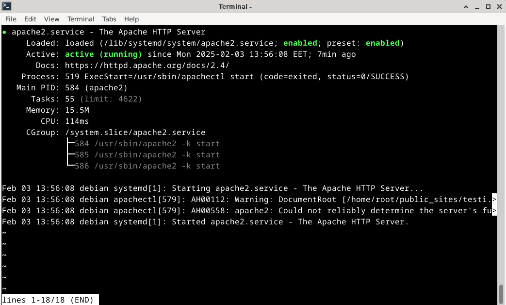

Kuvassa näkyy activen kohdalla running joka tarkoittaa että apache pyörii taustalla. Jos apache ei satu olemaan päällä, voi sen käynnistää komennolla "sudo systemctl start apache2" ja tarkastaa status komennolla että se myös lähti päälle.

Seuraavaksi testaan että minulla on toimiva yhteys webbisivulleni localhostin kautta. Tämä tapahtuu avaamalla jokin selain kuten firefox ja kirjoittamalla osoiteriviin "Localhost". Minulla avautuu minun tekemäni testisivu jossa lukee vain testi.

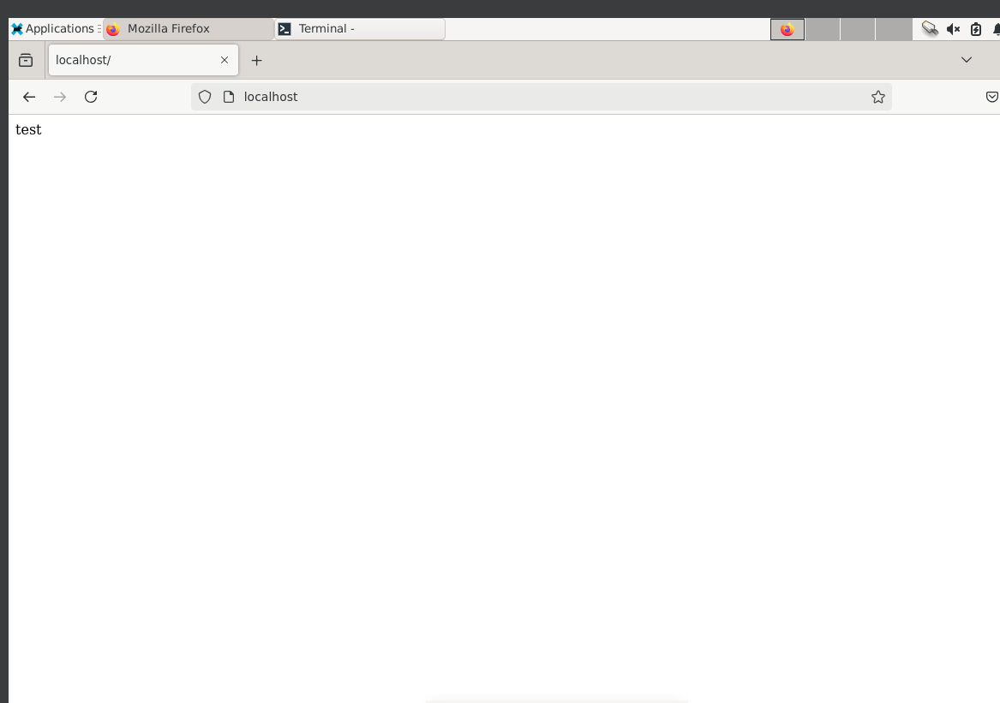

On myös toinen tapa testata sivun toimivuus terminalin kautta. Komento on "curl -I localhost" ja jos curlia ei löydy voi sen helposti asentaa komennolla "sudo apt install curl".

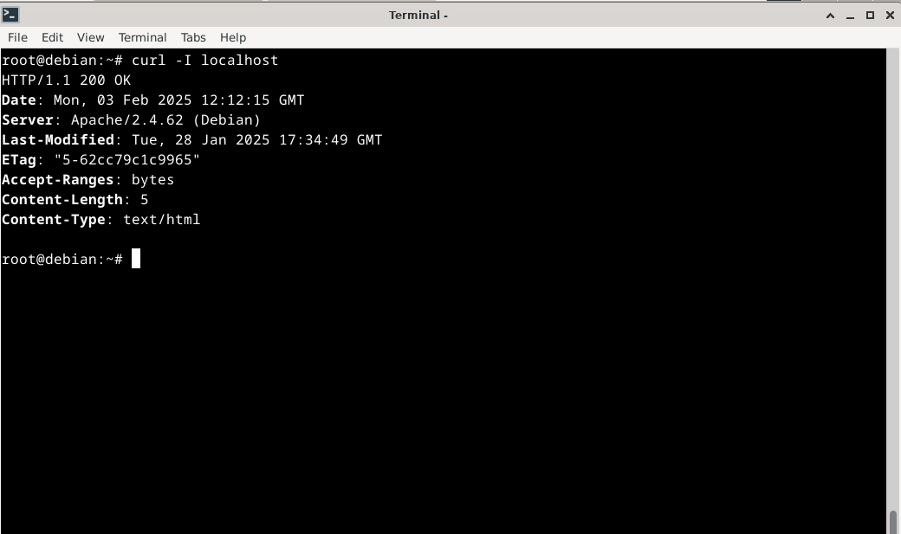

## Lokien analysointi

Apachen logit löytyvät linuxissa "/var/log/apache2" kansiossa. Tarkastellaan apachen access.log tiedostoa joka löytyy kansiosta.

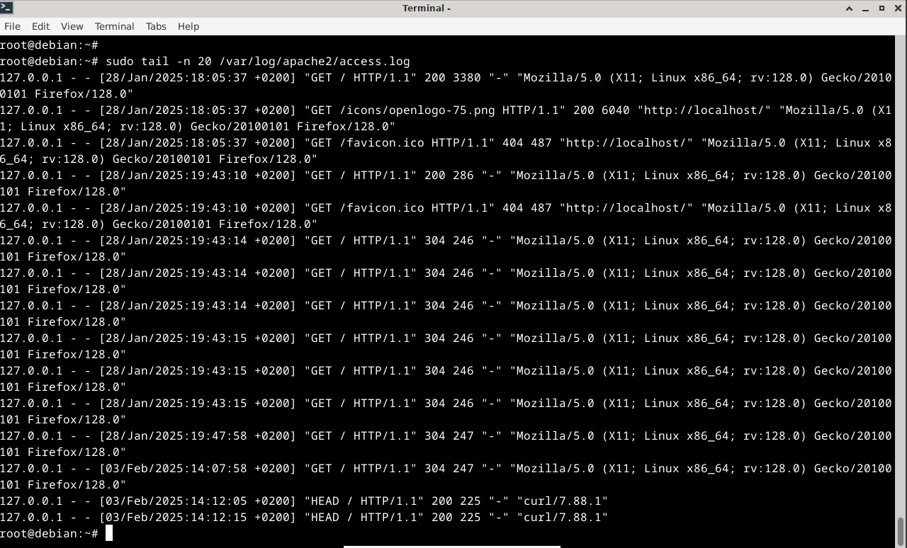

Tarkastellaan ensimmäistä riviä. Alussa on IP osoite josta pyyntö tuli (127.0.0.1 eli localhost), rivissä näkyy pyyntöhetki, pyynnön metodi (tässä GET), HTTP-statuskoodi (200 eli OK), 3380 on lähetettyjen tavujen määrä ja lopussa Mozilla/5.0 käytetyn selaimen tunniste, eli user agent. 

Koodi 200 tulee onnistuneesta pyynnöstä.

## Uusi name-based virtual host

Ensin loin uuden tiedoston komennolla "sudo nano /etc/apache2/sites-available/hattu.com.conf" ja lisäsin siihen seuraavat asetukset

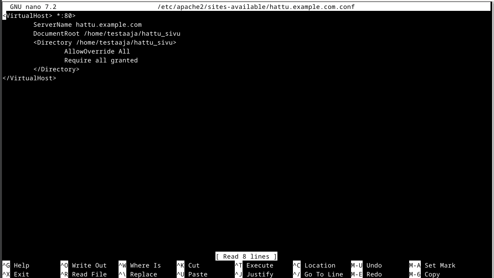

Seuraavaksi loin uuden kansion "mkdir -p /home/testaaja/hattu_sivu" komennolla ja lisäsin kansioon html tiedoston nimeltä index.html. Muokkasin tiedostosta validin html tiedoston.

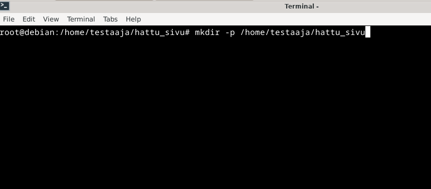

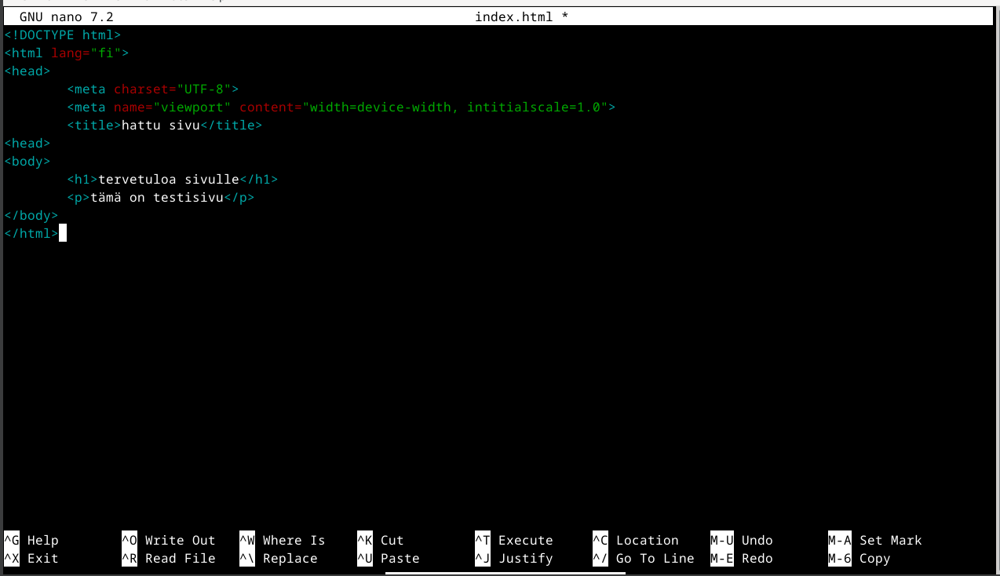

Otin uuden sivun ja deaktivoin vanhat sekä käynnistin apachen uusiksi komennoilla:

sudo a2dissite 000-default.conf
sudo a2ensite hattu.example.com.conf
sudo systemctl restart apache2

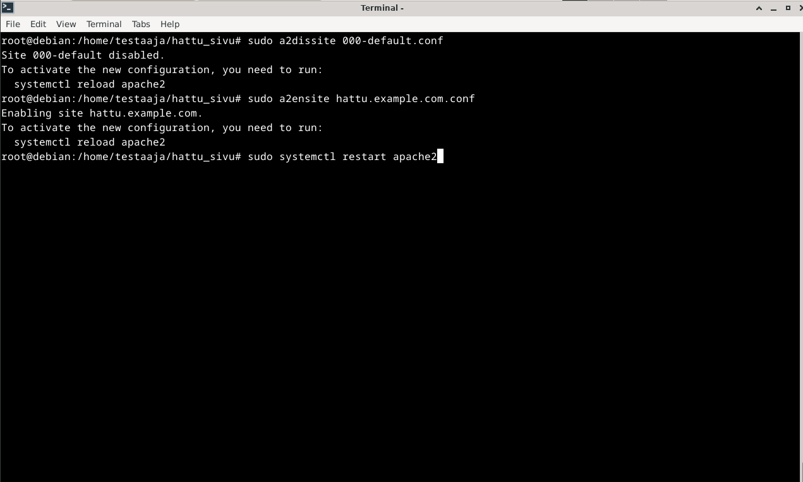

Tämän jälkeen lisäsin "/etc/hosts tiedostoon "127.0.0.1 hattu.example.com" ja poistin localhostin. Yritin avata webbisivua selaimessa ja sain 403 koodin, tarkoittaen että minulta on pääsy estetty.

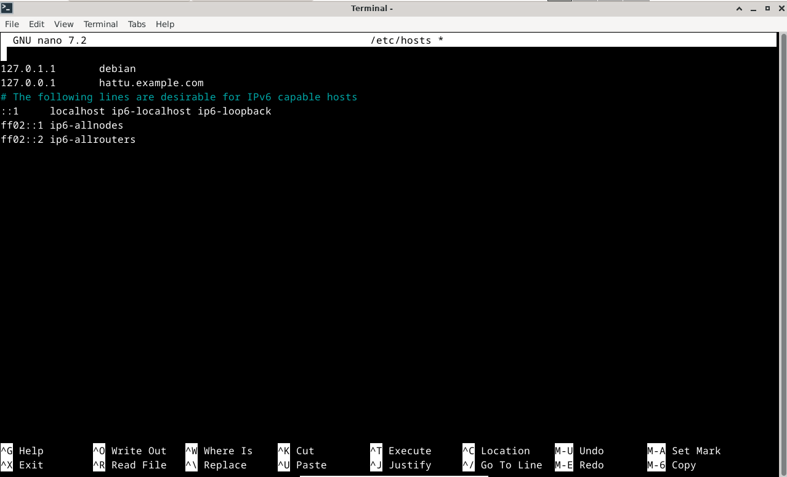

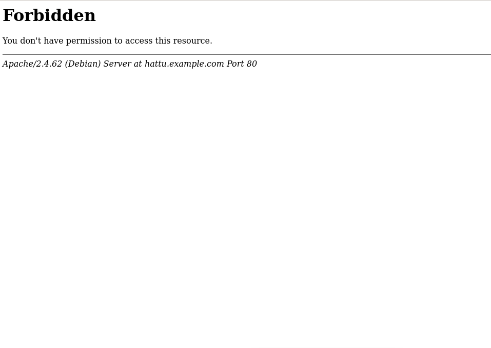

Ratkaisin ongelman antamalla oikeudet kansiolle

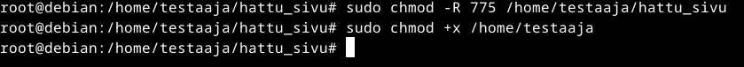

Laittamalla oikeudet ja koittamalla uudestaan mennä selaimen kautta sivulle aukeaa todellinen sivu ja vastauksena tulee 200 eli OK.

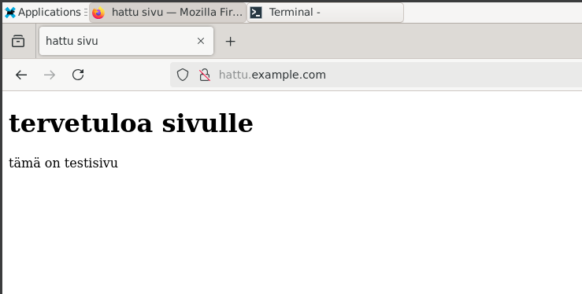

## Curl komento

Curl komennolla voi testata verkkosivuja. Otetaan testiksi curl komento hattu.example sivusta. Tämä on "curl -I http://hattu.example.com" komento. Komento hakee vain sivun "HTTP response headers".

Ensimmäisessä rivissä on HTTP koodi numeo 200 eli OK. Pyyntö meni siis läpi. Toisessa rivissä on palvelimen kellonaika. Kolmannella rivillä on palvelimen apache versio. Content-type kertoo mitä sisältöä sivu palauttaa. Content-length kertoo sivun koon tavuina.

Jos haluaa webbisivun koko sisällön niin voi käyttää melkein samaa komentoa, mutta jättää -I pois, eli "curl http://hattu.example.com".

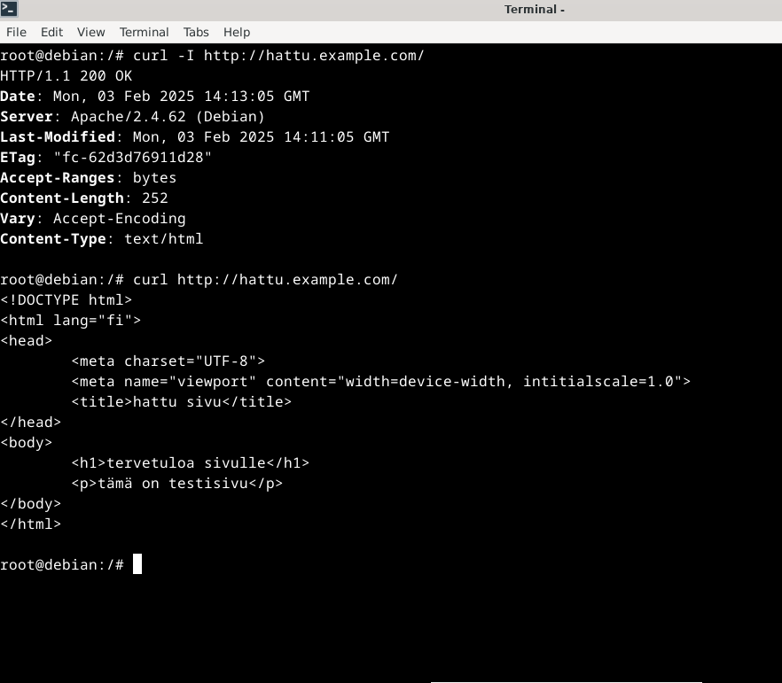