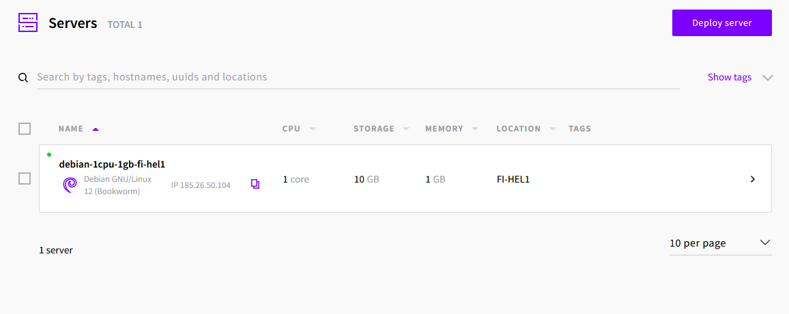
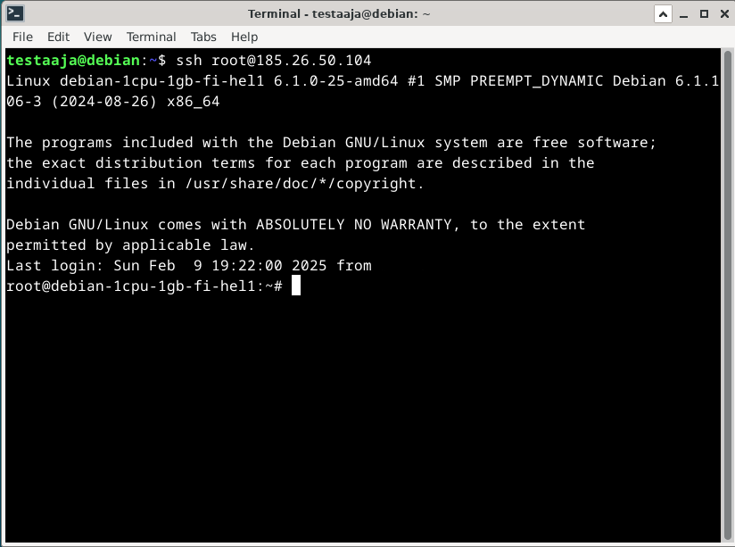
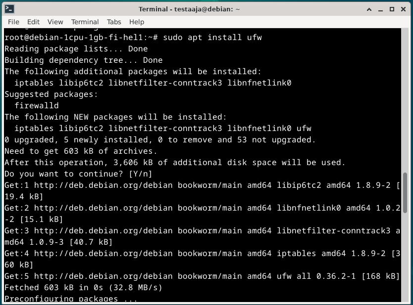
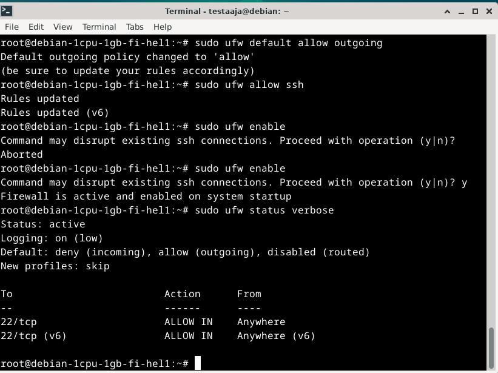
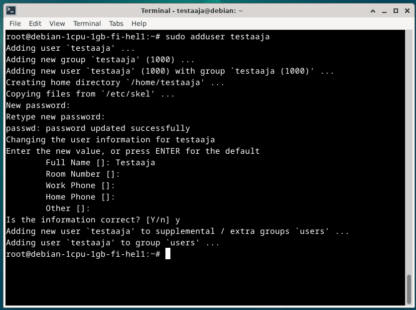
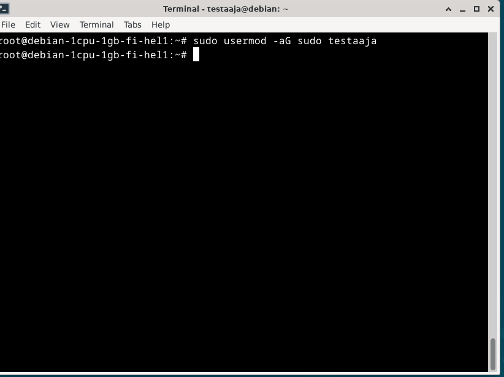
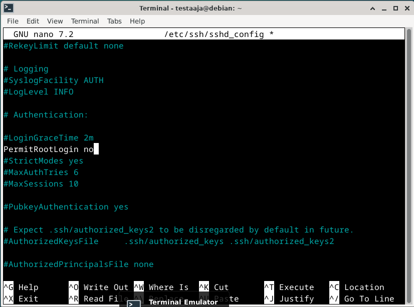
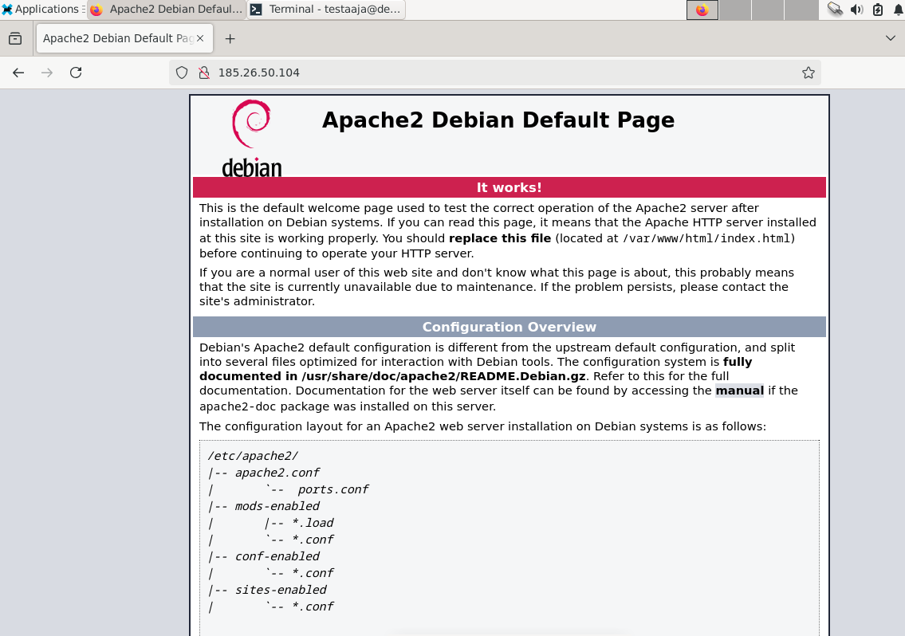
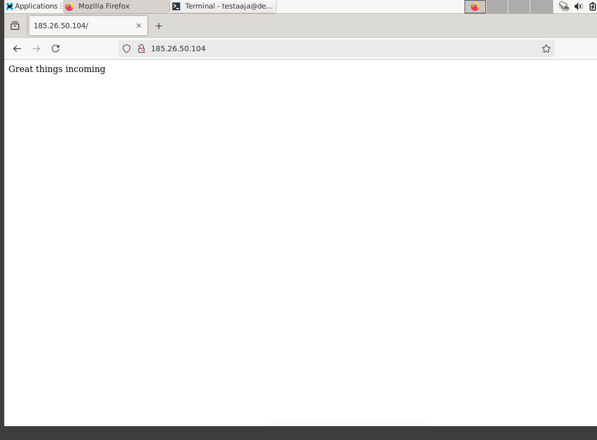

- GitHub Educationilla on mahdollisuus saada ilmainen domain ja vps
- DigitalOceanilta saa myös maksullisia palvelimia
- Määritä palomuuri, luo superuser käyttäjä ja muista lukita root tili
- Asenna webbipalvelin ja tee etusivu
- NameCheap tarjoaa edullisia hostnameja

# oma palvelin

Valitsin testipalvelimeksi halvimman mahdollisen jota upcloud tarjoaa. Deployaamisessa kysytään ssh avainta joten kirjauduin linux koneelleni ja loin uudet avaimet jotta pystyn ssh yhteydellä kirjautumaan palvelimeen sisään.

SSH yhteyden saatuani aloitin asentamalla uncomplicated firewall (ufw) komennolla sudo apt install ufw ja asennuksen jälkeen aloin säätämään palomuurin asetuksia seuraavilla komennoilla

>sudo ufw default deny incoming

>sudo ufw default allow outgoing

>sudo ufw allow ssh

>sudo ufw enable

>sudo ufw status verbose

haluan myös estää root käyttäjänä sisäänkirjautumisen. Tätä varten tarvitsen uuden käyttäjän. Käytän komentoa sudo adduser luodakseni käyttäjän ja sudo usermod annan käyttäjälle sudo oikeudet. Tässä luon käyttäjän testaaja.

Avaamalla nanon avulla tiedoston /etc/ssh/sshd_config ja menemällä kohtaan PermitRootLogin ja kirjoittamalla yes kohdalle no saa estettyä root kirjautuminen. Tallenna tiedosto samalla nimellä.

Tässä välissä on hyvä käynnistää SSH uudelleen käyttämällä komentoa "sudo systemctl restart ssh".

Luotu palvelin tarvitsee web-palvelimen. Asennan apachen palvelimelle komennolla "sudo apt install apache2 -y". Jos apache ei ole vielä käynnissä asennuksen jälkeen, voi sen käynnistää komennolla "sudo systemctl enable apache2" ja sudo systemctl start apache2"

Huomaan että yhteys ei onnistu ja muistan että unohdin lisätä palomuuriin vielä että päästää läpi http ja https liikenteen komennoilla

sudo ufw allow http
sudo ufw allow https

Muokkaamalla sivun index tiedostoa voidaan muuttaa sivun ulkonäköä.

