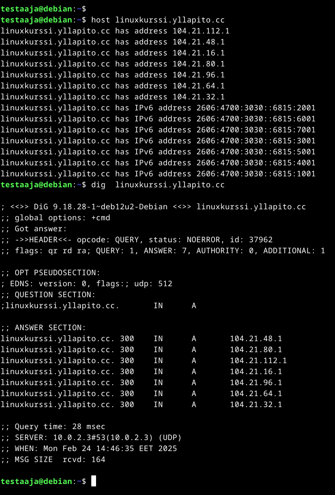

# Julkisen nimen käyttö vuokratulla domain-nimellä

Palvelin minulla on edelleen UpCloudilla ja päätin tällä kertaa hankkia domain-nimeni cloudflarelta, sillä NameCheapilla hinnat ovat liian korkeita. Domainin hankkiminen oli erittäin helppoa ja maksoi minulle vain 8$ ja uusiminenkin on saman verran. NameCheapilla jollain domaineilla ensimmäinen vuosi saattaa olla edullisempi, mutta uusiminen on usein huomattavasti kalliimpaa.

Jotta saan yhteyden palvelimellani olevaan webbisivuun, minun täytyy mennä Cloudflaren DNS asetuksiin ja lisätä DNS managementtiin domainini tiedot. Eli kirjaudun sisään Cloudflare sivulle ja valitsen sieltä domainini DNS asetukset.

Seuraava askel on testata, onnistuiko DNS asetuksien laitto. Teen tämän yksinkertaisesti yrittämällä yhdistää ostamaani domainiin selaimen kautta. Asetukset menivät oikein, sillä vastassa on Apachen oletussivu. Sivulle on siis pääsy ulkoverkosta.

Muokattuani vähän asetuksia ja säätämällä sivuja sain sivut täysin rikki. En enää päässyt sivulle ja tuli 403 Forbidden palautuksena. Ensiksi lähdin tarkastamaan oikeuksia ja että kaikki tietoni on oikein. Minun silmääni ainakin kaikki näyttää hyvältä, mutta webbisivu ei siltikään päästä minua sisään. Logeissakin näkyy selvästi että ongelma on 403, mutta syytä en löydä millään. Ongelmanratkaisuun on kulunut jo tovi joten päätän yrittää tehdä muut tehtävät silti.

Yritän silti luoda sivulleni alidomainit, vaikka sivussa on suuria ongelmia jotta pääsen eteenpäin tehtävissä. Palaan Cloudflaren sivulle ja siellä samoihin DNS asetuksiin kuin ihan alussa.

Lisään sinne kaksi alidomainia, esimerkki ja linuxkurssi. Testaan sivua menemällä yhdelle alidomainille. Alidomain toimii. Tässä minulla ei ole pääsy estetty.

Seuraavaksi tutkin sivujen tietoja host ja dig komennoilla:

Kun komentoja käyttää eri webbisivuille, niin tulee sivujen eri DNS tiedot näkyviin. Näissä yleensä näkyy IP osoite ja muut domain nimeen liittyvät tietueet. 

Jos lähettää host komennon kysytään annetun hostnamen tiedot. Jos takaisin tulee "has address"  niin on löytynyt DNS palvelimen kautta osoite. Listauksessa on myös IP-osoite, johon verkkotunnus viittaa.

Teen samat asiat myös google.com domainille. Huomaan että tässä on myös listattuna google.com sivun käyttämä sähköpostipalvelin, jota minun palvelimella ei ole, sillä en pyöritä mitään sähköopostipalvelinta tai muuta vastaavaa johon tarvitsisi erillisen mail serverin.

Jokin on käyttöoikeuksisas pahasti vialla ja olen yrittänyt säätää sitä ja nyt varmaan säätänyt rikki. Minun pitää luultavasti nollata palvelin ja asentaa kaikki uudestaan jotta turvallisuus on taattu. En onnistu saamaan sivua näkyviin. Lisään tähän päivityksen mikäli onnistun korjaamaan ongelman.

#### Lähteet

https://terokarvinen.com/linux-palvelimet/'

https://developers.cloudflare.com/