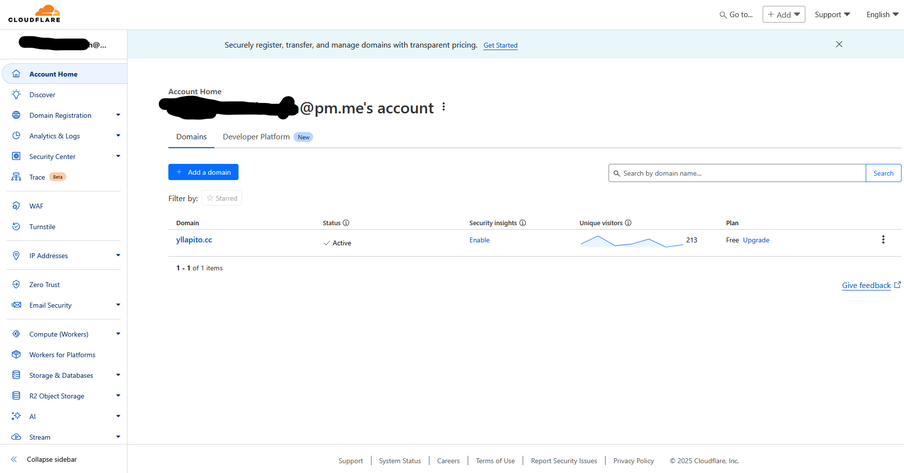
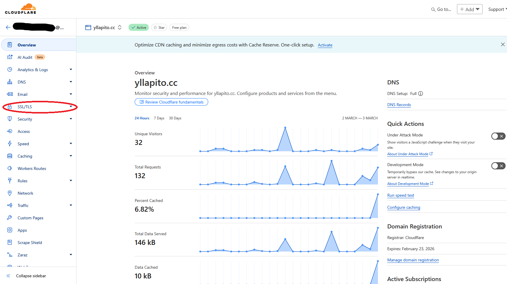
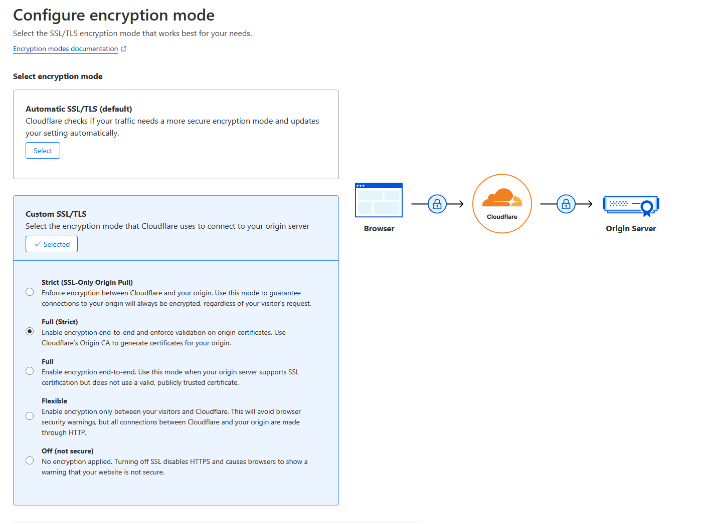
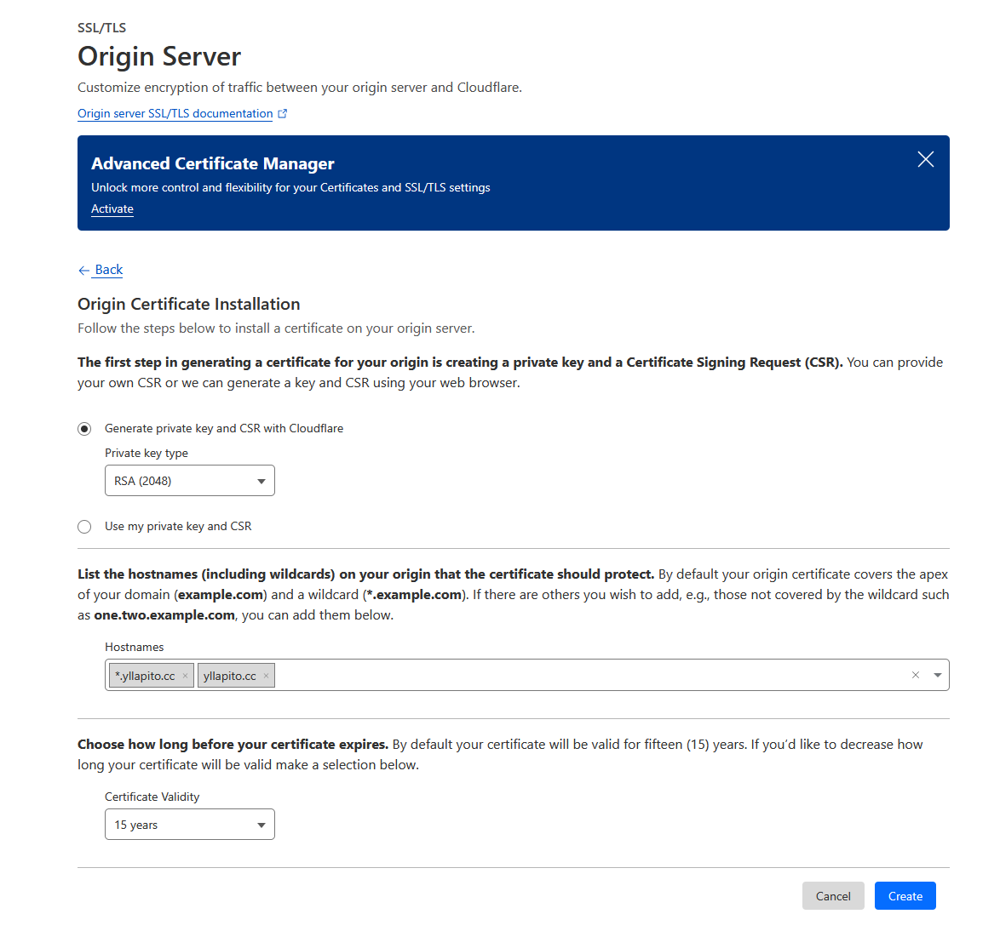
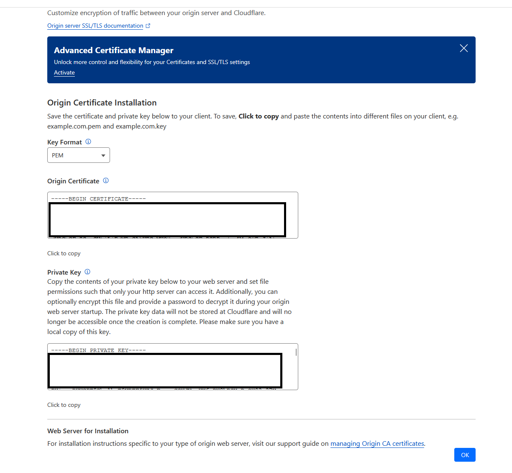
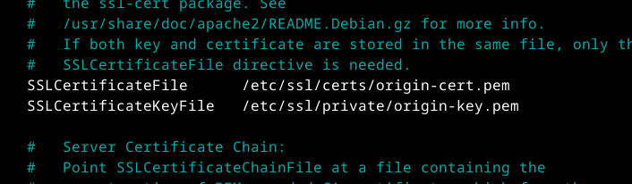
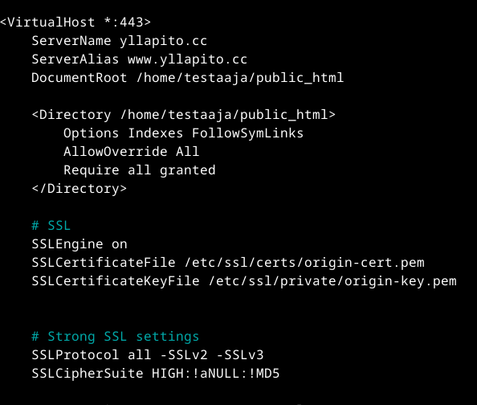
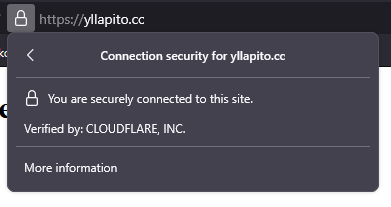
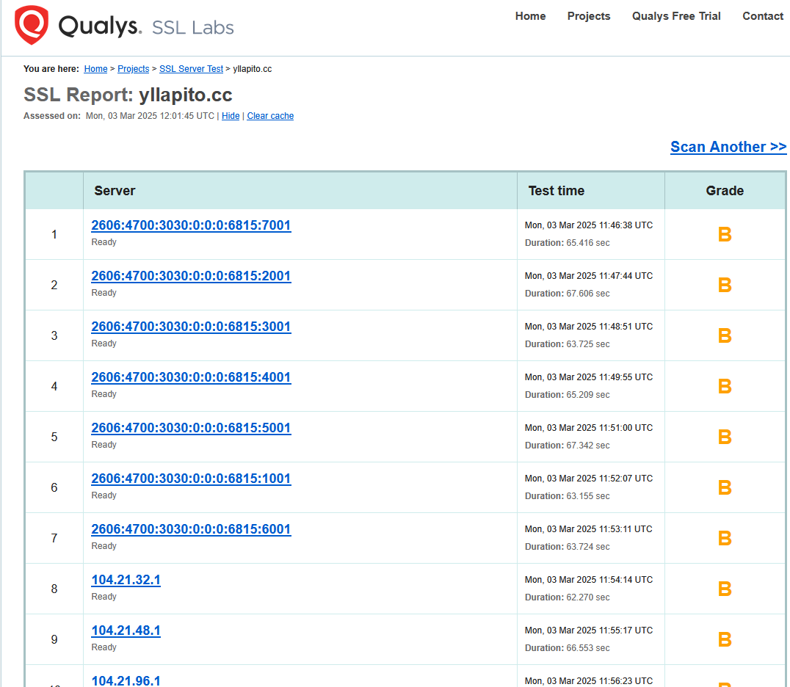

# h6 Salataampa

Lets Encrypt

- Lets encrypt tarjoaa ilmaisia SSL/TLS-sertifikaatteja verkkosivustojen tietojen salaamiseksi
- Tavoite on tehdä salaus helpoksi ja saatavilla kaikille halukkaille
- Sertifikaatit on automaattsia ja ne voidaan uusia säännöllisesti

Lange 2024: Lego: Obtain a Certificate: Using an existing, running web server
- Toimivalla webbipalvelimella portilla 80 on mahdollisus käyttää HTTP-01 validointia SSL-sertifikaatin hankkimiseen
- Webroot hakemisto pitää itse määrittää ja sen tehtävä on kertoa mihin palvelin tallentaa validointitiedoston
- HTTP-01 challenge teidosto pitää tallentaa hakemistoon .well-known/acme-challenge ja sen täytyy olla julkisesti saatavilla kyseisellä palvelimella

The Apache Software Foundation 2025: Apache HTTP Server Version 2.4 [Official] Documentation: SSL/TLS Strong Encryption: How-To: Basic Configuration Example
- Location kohdalla voi pakottaa vahvan salauksen tietyille osoitteille
- Salli vain vahva salaus: 'SSLCipherSuite HIGH:!aNULL:!MD5'

## TSL Sertifikaatin hankkiminen omalle webbipalvelimelle

Tänään yritän saada webbisivuni turvallisemmaksi SSL (Secure Socket Layer) protokollan avulla. Protokolla suojaa ja salaa verkkoliikennettä selaimen ja minun webbipalvelimeni välillä. Protokollalla voi varmistaa että tärkeät tiedot kuten salasanat ja esimerkiksi pankkikorttien tiedot eivät vuoda salaamattomana näkyviin.

Protokollalla ja siihen liittyvällä sertifikaatilla voi varmistaa että henkilökohtaiset ja arkaluontoiset tiedot pysyvät suojattuna ja estää kolmansien osapuolien sieppausyritykset esimerkiksi wiresharkin avulla. Suojaamattomat tiedot näkyvät tietyissä ohjelmissa ihan selkotekstinä ja ei salattuna, ja siitä on taas helppo varastaa tiedot itselleen.

Minulla on webbisivun domain-nimi Cloudflaren kautta hankittu, joten se on minulle myös järkevin tapa hankkia itselleni sertifikaatti. Myös Cloudflare käyttää tietyissä tilanteissa LetsEncryptin sertifikaatteja.

Aloitan navigoimalla Cloudflaren sivulle ja kirjaudun sisään jotta pääsen dashboardiin. Dashboardissa valitsen webbisivuni ja sen jälkeen sivupalkista SSL/TLS.

SSL/TLS osiossa valitsen kohdan Overview. Tässä kohtaa painan configure ja menen säätämään asetuksia. Haluan täyden salauksen, joten valitsen Full(Strict) kun kysytään encryption modesta. Nyt menen Origin Server kohtaan sivupalkissa. Tässä kohtaa täytän tarvittavat tiedot kenttiin. Tässä käytän "*.yllapito.cc" wildcardia, jotta jokainen alidomain on myös suojattu.

Kun painan Create, niin pääsen sivulle jossa näkyy minun avaimet. Nämä avaimet ovat tärkeitä ja muiden ei pitäisi saada niitä nähdä. 

Nyt kun meillä on avaimet, niin meidän pitää tehdä tiedostot niille. Komennolla "sudo nano /etc/ssl/certs/origin-cert.pem" avaan tekstitiedoston johon laitan äskettäin saadun Origin certificaten ja tallennan sen. Toistan tämän private keylle komennolla "sudo nano /etc/ssl/private/origin-key.pem". Kun avaimet on kopioitu, pitää meidän vielä kertoa Apachelle missä avaimet ovat. Tätä varten avaan ssl konfiguraatio tiedoston komennolla "sudo nano /etc/apache2/sites-available/default-ssl.conf"

Tiedostossa pitää navigoida kohtaan jossa avaimet ovat ja lisätä meidän juuri tekemien sertifikaattien hakemistot. 

Tämän jälkeen SSL voi aktivoida ja Apachen voi käynnistää uudelleen komennolla "sudo a2enmod ssl && sudo systemctl restart apache2"

Tärkeää on vielä muokata meidän Name based virtual hostia jotta se osaa käyttää suojattua yhteyttä.

Nyt voimme testata toimiiko salattu yhteys.

Navigoin selaimella webbisivulleni käyttäen https:// etuliitettä ja pääsen sivulle. Sivulla on nyt lukko ja sitä painamalla saa tiedot.

Nyt kun sivun salaus toimii, voin testata webbisivuni laadunvarmistustyökalulla. Valitsen tähän SSLLabsin työkalua.

Annan testin pyöriä ja saan arvosanaksi B. Arvosana B tarkoittaa että SSL configuraatiossa on vielä jotain häikkää ja webbisivun turvallisuutta voisi vielä parantaa. 

#### Lähteet

https://terokarvinen.com/linux-palvelimet/

https://developers.cloudflare.com/

https://www.ssllabs.com/ssltest/