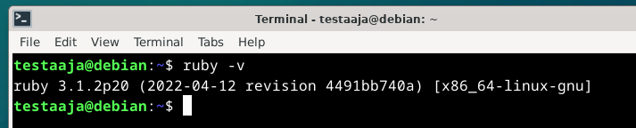
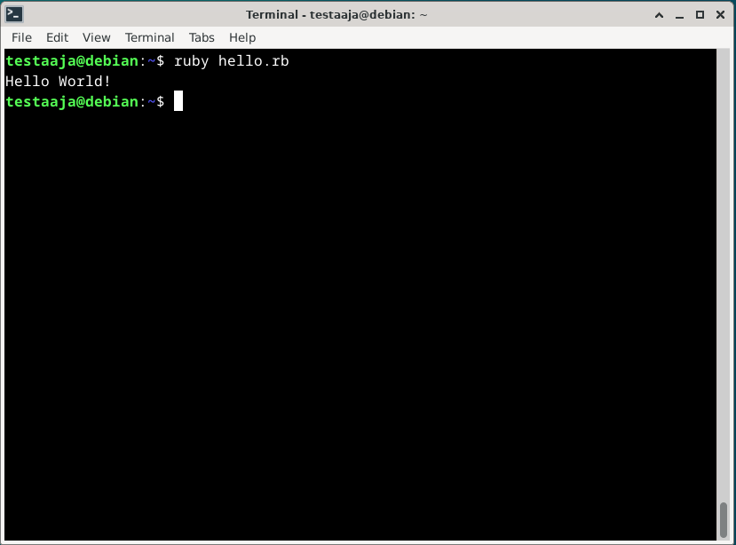
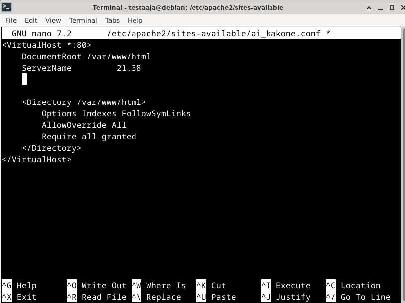

# h7 Maalisuora

a) Valitsin kieliksi seuraavat kielet: Python, Ryby ja Lua. Kuten tunnilla opimmen, python on jo asennettuna debianiin. Voin kyllä vielä tarkastaa että se on asennettu komennolla `python3 --version`.

Seuraavaksi teen yksinkertaisen hello world tiedoston. Annetaan sen nimeksi vaikka `hello.py`. Terminal auki ja komento `sudo nano hello.py` kenttään. Tiedosto aukeaa ja lisään siihen pätkän python koodia ja tallennan tiedoston.

"Ohjelman" suorittaminen on helppoa, terminaaliin täytyy vain kirjoittaa `python3 hello.py`

Teen saman jutun rubylla. Ruby ei ole asennettuna ennaltaan, joten joudun tekemään sen itse. Kirjoitan terminaaliin `sudo apt-get install ruby-full`. Asennuksen jälkeen tarkastan, onnistuiko asennus. Käytän tähän komentoa `ruby -c`.

Luon taas hello tiedoston, mutta tällä kertaa laitan loppuun `.rb`.

Suoritan sen komennolla `ruby hello.rb`

Saman teen Lua ohjelmointikielellä. Ensiksi asennan Luan. Tämä onnistuu komennolla `sudo apt install lua5.4` ja voin taas tarkastaa että kaikki onnistui komennolla `lua -v`.

Sama juttu kuin aikasemminkin, mutta perään `.lua`

Kaikki kolme kieltä toimii ja näyttää mitä pitää.

### Uusi komento linuxiin

Teen uuden komennon linuxiin joka kertoo minulle tämänhetkisen kellonajan ja päivämäärän. Käytän siihen myös ohjelmaa cowsay, jotta lehmä voi kertoa minulle päivän ja ajan.

Cowsayn asennus onnistuu komennolla `sudo apt install cowsay`. Kun cowsay on asennettu teen uuden skriptitiedoston. Lisään tiedostoon `cowsay "$(date)"` ja annan tiedoston nimeksi timecow ja tallennan sen /usr/local/bin kansioon. Jotta kaikki voivat käyttää sitä, annan oikeudet.

Jos kaikki meni oikein, voin kirjoittaa terminaaliin `timecow`

# Vanha labra

Tässä on [tämän](https://terokarvinen.com/2024/arvioitava-laboratorioharjoitus-2024-linux-palvelimet/) labran ratkaisuyritys.

## Howdy

Tässä käytin taas cowsayta, jotta saisi komennosta vähän monipuolisemman. Asensin cowsayn samalla tapaa kuin ennenkin. Nanolla loin uuden tiedoston ja muokkasin sitä. Käytän tässä `df` komentoa, joka näyttää vapaan levytilan.

Tämän jälkeen pitää muuttaa tiedoston käyttöoikeuksia:

Tämän jälkeen kaiken pitäisi toimia. Testaan komentoa terminaalissa kirjoittamalla vain `howdy` kenttään.

## Etusivu uusiksi

Asennan palvelimelle Apache webbipalvelimen käyttämällä komentoa `sudo apt install apache2`. Asennuksen jälkeen voin tarkastaa että apache on asennettu ja päällä. Käytän komentoa `sudo systemctl status apache2` tämän varmistamiseksi.

Navigoin `/var/www/html` kansioon ja luon uuden index tiedoston jossa on AI Kakone yrityksen tulevat webbisivut.

Seuraavaksi navigoin `/etc/apache2/sites-availableen` ja luon sinne uuden `.conf` tiedoston. 

Seuraavaksi webbisivu pitää käynnistää komennolla `sudo a2ensite ai_kakone.conf`. Nyt voin navigoida webbisivulle ja sen pitäisi näkyä.

## Salattua hallintaa

Ensimmäinen askel on asentaa ssh palvelin. Tämä onnistuu komennolla `sudo apt install ssh-client`.

Luon uuden käyttäjän komennolla `sudo adduser noppa`.

Seuraavaksi luon käyttäjälle avaimet jotta voin kirjautua SSH yhteyden kautta sisään.

Nyt voin yrittää kirjautua SSHn kautta palvelimelle. Tämä näyttää toimivan.

## Djangon asennus Debianiin

Djangon asentaminen debianiin on hyvin yksinkertaista ja ei vaadi kuin yhden komennon: `sudo apt install python3-django`. Asennuksen jälkeen voi tarkastaa onnistuiko asennus komennolla `django-admin --version

#### Lähteet

https://terokarvinen.com/linux-palvelimet/

https://terokarvinen.com/2024/arvioitava-laboratorioharjoitus-2024-linux-palvelimet/

